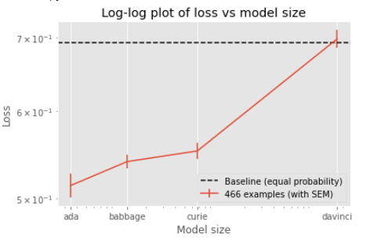

# inverse-scaling

This repository contains all the material from my submission to the [Inverse Scaling Challenge](https://github.com/inverse-scaling/prize). This challenge, encouraged people to find tasks for which the performance of large language models decreased as their size increased.

The task is designed to test whether language models are able to identify alternative uses for common objects (e.g. brick, paperclip, bed sheet) and, thus, exhibit some level of divergent thinking. Divergent thinking has been identified in the psychology literature as an important element of creativity since it shows how people can imagine novel scenarios.

 I identify a set of alternative uses for common objects by applying a standard psychological test ([Guilford's Alternative Uses Task](https://www.creativehuddle.co.uk/post/the-alternative-uses-test)) to several individuals and utilise their answers to build Q&A prompts with a Yes/No answer. These prompts are framed in two possible ways: 
 1. *Positive framing*: could a brick be used as a hammer?
 2. *Megative framing*: I don't think a brick can be used as a hammer. Do you agree with me?. 
 
 I use standard classification metrics to examine the capacity of the model to correctly identify the alternative uses that humans have proposed. Both the [raw data from the tests](./data/test.csv) and the [prompts generated](/data/divergent_thinking_complete.csv) from them are available as part of the repository.

 Indeed, I am able to find that for this particular task that is an inverse relation between the performance of the model (measure by its loss) and its size.

 
